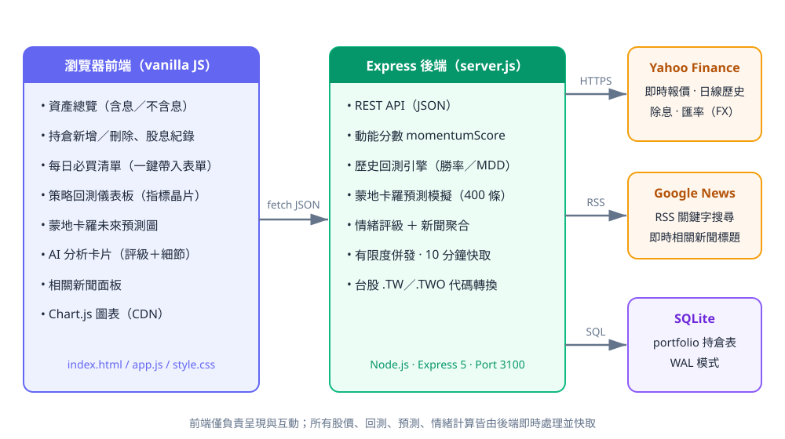
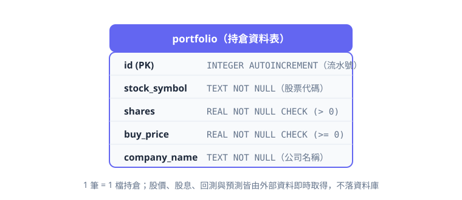
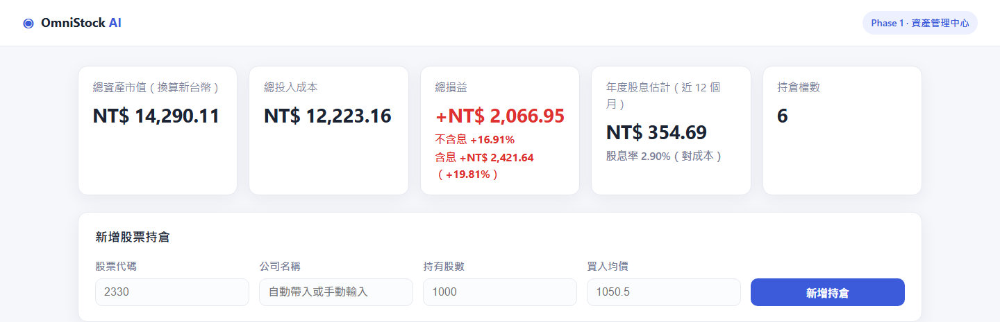
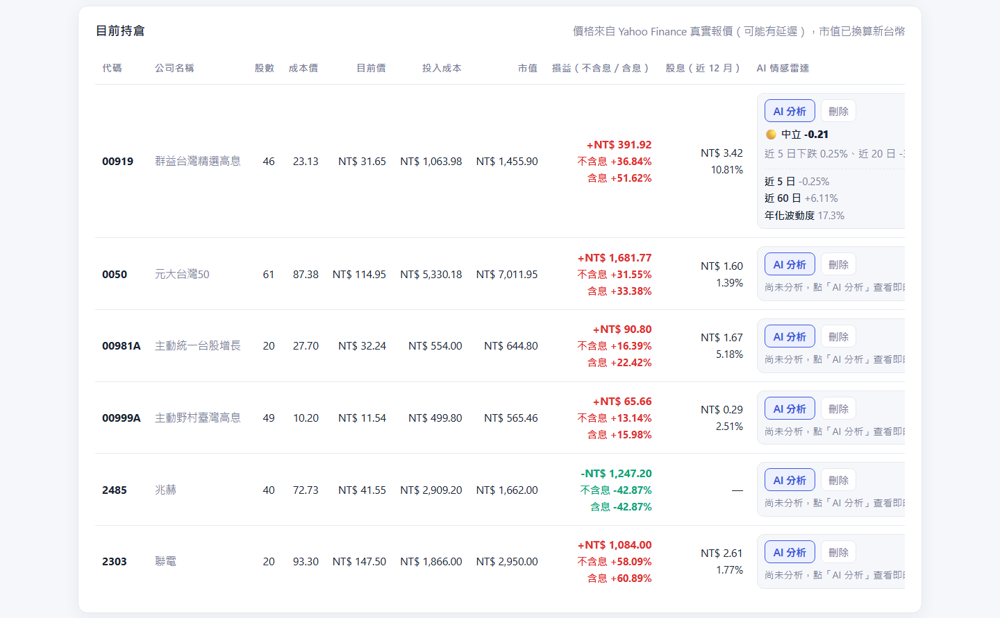
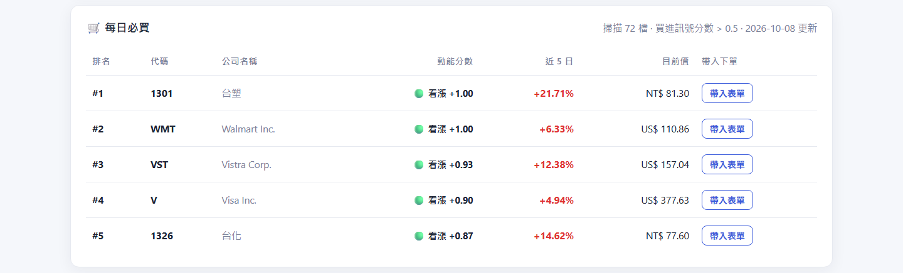
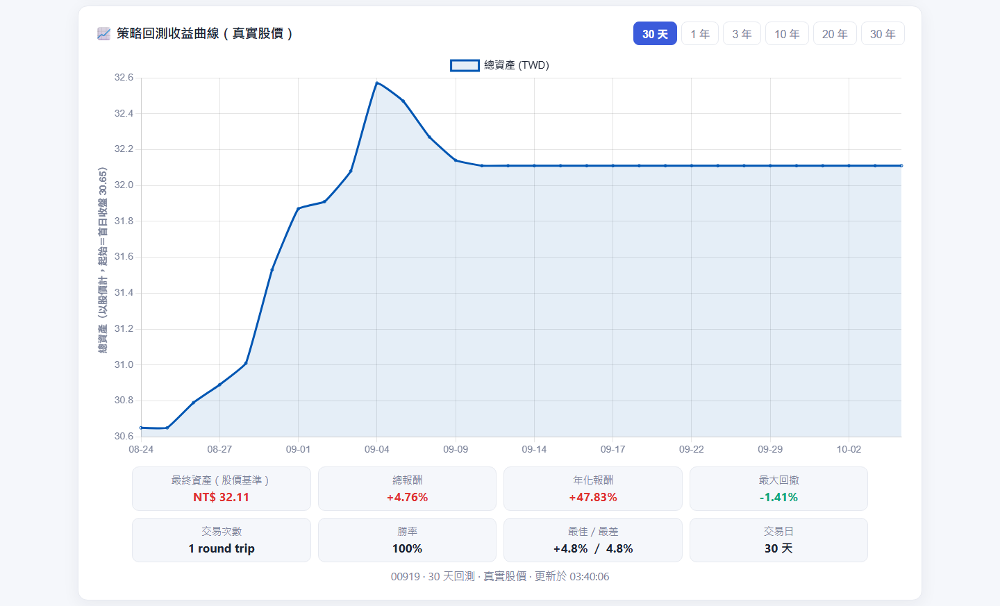
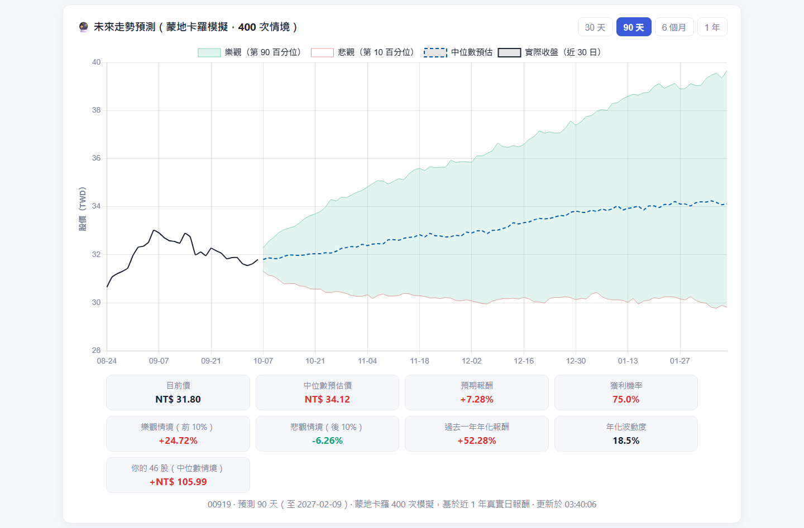

# OmniStock AI — 智慧股票資產管理平台（Hw3）

## 系統介紹

**OmniStock AI** 是一套以「**瀏覽器前端 → Express 後端 → SQLite／外部財經資料**」三層架構打造的個人股票資產管理中心，全程串接 **Yahoo Finance** 真實報價（即時價格、日線歷史、除息紀錄、匯率）與 **Google News RSS**，不使用任何假資料。

- **資產總覽**：五張摘要卡片即時呈現總市值、總成本、總損益（同時顯示**不含息／含息**兩種口徑）、累計股息與持倉檔數，讓你一眼掌握真實績效。
- **持倉管理**：內建 72 檔台股＋美股清單，輸入代碼自動帶入公司名稱；新增／刪除持倉後自動抓取即時報價，計算損益、報酬率、股息率與年度股息明細。
- **每日必買**：每日掃描全清單 72 檔的真實股價，依**價格動能分數**排序，優先挑出買進訊號（分數 > 0.5）的前 5 檔，附評級、近 5 日漲幅與即時價格，一鍵「帶入表單」即可下單。
- **策略回測**：以真實日線資料回測「動能 > 0.5 全倉買進、< -0.3 全倉賣出」策略，支援 30 天～30 年期間切換，產出年化報酬、總報酬、最大回撤、勝率、交易次數與最佳／最差交易等完整指標。
- **蒙地卡羅預測**：以 400 條隨機路徑模擬未來 30 天～1 年的股價走勢，繪製 P10／中位數／P90 區間帶與上漲機率；離線時自動退回歷史模擬後備。
- **AI 分析**：點擊「AI 分析」即時計算動能分數（近 5 日報酬歷史百分位）、5／20／60 日漲跌、年化波動度、距離 52 週高低點，給出綠／黃／紅評級與文字摘要，並帶出 Google News 即時新聞標題。

```
瀏覽器（HTML / CSS / JavaScript + Chart.js）
        │  fetch（JSON）
        ▼
Express 後端（server.js）── 回測引擎、蒙地卡羅模擬、動能分數、資料快取
        │                │                │
        ▼                ▼                ▼
 Yahoo Finance       Google News       SQLite（portfolio 持倉表）
 報價／日線／股息      RSS 新聞
```

### 功能總覽

| 區塊 | 功能 |
|------|------|
| 資產總覽 | 總市值、總成本、總損益（含息／不含息）、累計股息、持倉檔數，5 卡即時同步 |
| 持倉管理 | 新增／刪除持倉、72 檔下拉自動完成、代碼自動帶入名稱、即時報價、股息率、年度股息 |
| 每日必買 | 掃描 72 檔依動能分數排序取前 5、評級徽章、近 5 日漲幅、一鍵帶入下單表單（30 分鐘快取） |
| 策略回測 | 真實日線、30d～30y 切換、年化報酬／總報酬／最大回撤／勝率／交易次數／最佳與最差交易 |
| 蒙地卡羅預測 | 400 條路徑、30d／90d／180d／1y、P10／中位數／P90 區間帶、上漲機率、中位報酬 |
| AI 分析 | 動能評級（綠／黃／紅）、摘要與 10 項量化細節、Google News 即時新聞標題 |
| 資料層 | Yahoo Finance 即時報價／日線／除息／匯率、台股 `.TW`／`.TWO` 自動轉換、10 分鐘快取 |

## 系統架構圖



## 資料庫 ER 圖



## 系統畫面

### 總覽與新增持倉



### 目前持倉（含息／不含息損益 ＋ AI 分析卡片）



### 每日必買 | 策略回測

| 每日必買 | 策略回測儀表板 |
|------|------|
|  |  |

### 蒙地卡羅未來預測



## 技術架構

| 層級 | 技術 |
|------|------|
| 前端 | HTML5／CSS3／JavaScript（vanilla）、Chart.js（CDN） |
| 後端 | Node.js、Express 5 |
| 資料庫 | SQLite（`sqlite3`，WAL 模式） |
| 外部資料 | Yahoo Finance（報價／日線／除息／匯率）、Google News RSS |
| 部署 | 本機 `http://localhost:3100` |

## API 一覽

| 方法 | 路徑 | 說明 |
|------|------|------|
| GET | `/api/stocks` | 股票清單（72 檔） |
| GET | `/api/stocks/:symbol` | 單一檔基本資料 |
| GET | `/api/portfolio` | 持倉列表（含即時報價、損益、股息） |
| POST | `/api/portfolio` | 新增持倉 |
| DELETE | `/api/portfolio/:id` | 刪除持倉 |
| GET | `/api/quotes?symbols=2330.TW,WMT` | 即時報價（含除息、股息率、TWD 換算） |
| GET | `/api/backtest/:symbol?range=1y` | 動能策略回測（30d～30y、指標與交易明細） |
| GET | `/api/forecast/:symbol?horizon=90d` | 蒙地卡羅預測（30d／90d／180d／1y） |
| GET | `/api/daily-picks` | 每日必買（動能分數前 5） |
| GET | `/api/sentiment/:symbol` | AI 分析（動能評級＋細節＋新聞標題） |

## 執行方式

```bash
npm install
npm start
```

瀏覽器開啟 **http://localhost:3100** 即可使用。

## 資料來源與免責聲明

- 股價、歷史日線與除息資料來自 **Yahoo Finance**，可能存在延遲或偶發抓取失敗（已內建快取與離線後備）。
- 新聞標題來自 **Google News RSS**，依關鍵字即時搜尋。
- 本專案僅供課程學習與研究使用，**不構成任何投資建議**。
